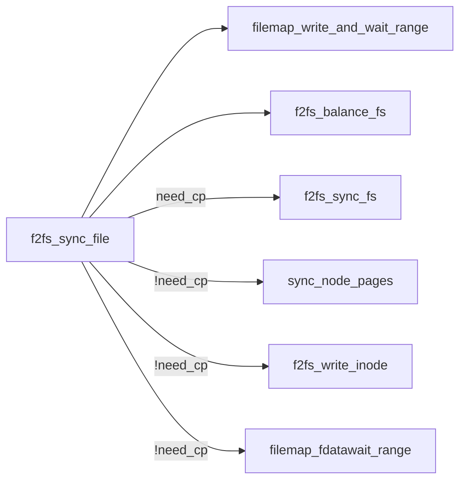
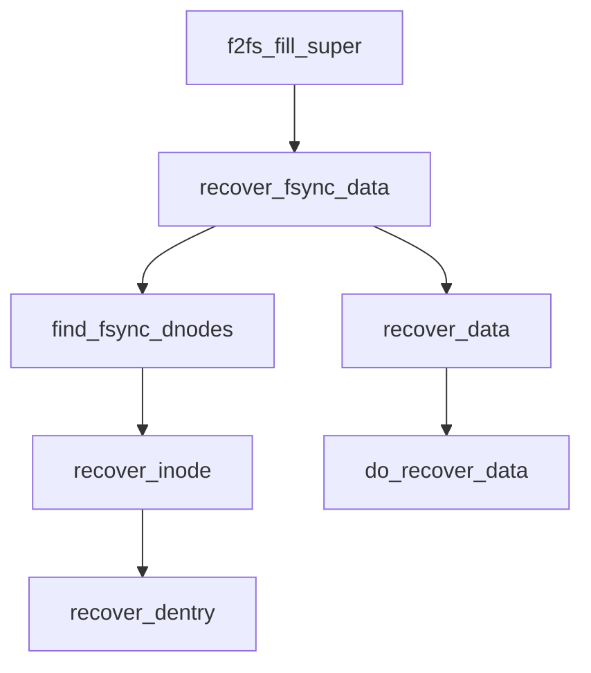

崩溃恢复包括正常状态下的fsync和上电后的前滚恢复。因3.8版本中的f2fs是初版，较为简单。因此本文分析Linux 3.8版本中的崩溃恢复流程，借以了解崩溃恢复。

## fsync分析



fsync函数的原型为int f2fs_sync_file(struct file *file, loff_t start, loff_t end, int datasync)，其作用是将file指向的文件中，偏移量从start到end的部分刷写下盘。

### 刷写数据部分

文件系统通过wbc结构体来控制写回过程的行为。这里设置wbc为

```c
	struct writeback_control wbc = {
		.sync_mode = WB_SYNC_ALL, // 同步写回，等待所有页面的写回完成
		.nr_to_write = LONG_MAX, // 暂时不设置在本次操作中最多写回的页面数
		.for_reclaim = 0, // 表示当前的写回操作不是为了回收页面触发的，而是由于fsync
										  // 在内存不足的情况下，内核通过回收页面来释放内存，
										  // 在回收页面之前要先将页面写回存储设备
	};
```

如果文件系统在挂载时设置为只读的，即sb中设置了MS_RDONLY标志位，则直接返回0，因为无法在只读的文件系统中写回。

接下来通过filemap_write_and_wait_range函数写回start到end的数据。函数原型是`int filemap_write_and_wait_range(struct address_space * mapping, loff_t lstart, loff_t lend);`

该函数是一个同步操作，将mapping中lstart至lend中的脏页刷盘，等待写回完成后再返回。也即将文件指定范围的内容持久化。mapping是文件在内存中的地址空间。

在写回数据之后，调用f2fs_balance_fs检测sbi以确定是否还有足够的空闲section，如果没有就做一次主动GC。实际上这个函数经常在和写入相关的操作中被调用，每次写入后都要检查一下。

fsync和fdatasync都通过f2fs_sync_file函数执行。如果当前执行的时fdatasync，则到这里就已经结束返回了。下面是fsync中针对元数据的操作。

### 刷写元数据部分

```c
	if (F2FS_I(inode)->data_version != cur_version &&
					!(inode->i_state & I_DIRTY))
		goto out;
	F2FS_I(inode)->data_version--;
```

检查该文件的data_version是否等于当前CP的cur_version。如果不等于，说明该文件是上一次CP之前就存在的，盘上有它的inode结构和目录结构。如果该文件的I_DIRTY标志位没有置位，则该文件没有发生任何变化。因此不需要做任何操作。

问题：如果该文件没有发生任何变化，为何不在最开始就做这个判断？并且5.15中没有做这个判断。

问题：为何需要F2FS_I(inode)->data_version--;？

接下来判断是否需要CP。

```c
	if (!S_ISREG(inode->i_mode) || inode->i_nlink != 1)
		need_cp = true;
	if (is_inode_flag_set(F2FS_I(inode), FI_NEED_CP))
		need_cp = true;
	if (!space_for_roll_forward(sbi))
		need_cp = true;
	if (need_to_sync_dir(sbi, inode))
		need_cp = true;
```

- 第一个if：如果不是普通文件或硬链接计数不为1（文件已被删除或有多个硬链接） 问题：为什么有多个硬链接也要CP？
- 第二个if：如果具有需要CP的标记
- 第三个if：如果没有足够的空间做前滚，也就是距离上一次CP太远了，需要前滚的数据太多了
- 第四个if：如果该文件所在目录文件不在上一个CP点中

如果需要CP则做CP，否则只落盘元数据，包括dnode和inode。

接下来使用sync_node_pages落盘该文件的inode和脏dnode。f2fs在做fsync的时候先将所有修改过的数据落盘（即上面的filemap_write_and_wait_range），再将其node元数据落盘（即这里的sync_node_pages）。必须保证这个顺序，否则如果fsync没有做完就断电了，上电后根据node恢复数据的时候dnode指向的数据是空的或错的。

_这里需要对照具体的代码看。_

在sync_node_pages中，用到的地址空间是sbi→node_inode→i_mapping。其中node_inode是一个特殊的文件，用于管理内存中的node。

扫描node_inode中的所有node，pagevec_lookup_tag用于查找其中具有PAGECACHE_TAG_DIRTY标记的脏node，并将其放入pvec中。

扫描pvec。当扫描到的node属于该文件时，为其打上fsync标记。如果扫描到的是inode，还要打dentry标记。dentry标记是指如果某个文件没有持久化过，则盘上的目录文件没有相应的结构，也没办法寻找到这个文件。_**因此需要为其单独创建一个inode结构**_，并在目录中加入这个文件。（在5.15版本中，当文件没有CP过并且也没有做过fsync才打dentry标记，第二次fsync不打）

打完标记后，通过f2fs_write_node_page和f2fs_submit_bio将node page刷写下盘。这里前者应当只是构造合并了bio，放在sbi->bio[NODE]还没有提交。后者提交bio。

如果sync_node_pages没有写下任何node page，说明该文件的node都不脏。这种情况应当是truncate过，也就是删除了文件的一部分，因此没有脏node。这种情况下仅通过f2fs_write_inode刷写其inode。

问题：truncate后不应该做CP吗？可能这个早期版本没有考虑周全。

最后调用filemap_fdatawait_range确保所有的脏node都已经刷盘，这是一个同步等待操作。

# 前滚回复分析



在挂载文件系统后，f2fs_fill_super函数调用recover_fsync_data函数做前滚回复。前滚恢复的过程包括两次扫描，即find_fsync_dnodes和recover_data。

第一次扫描find_fsync_dnodes的作用是通过扫描恢复区域的node page，确定有哪些文件是需要恢复的，并将其加入inode_list链表中。第二次扫描recover_data的作用是通过扫描恢复区域的node page，利用这些node page的内容重建文件。

_**注意：**_

- 两次扫描的范围相同。
- 扫描的对象是普通文件的dnode，也就是直接存储文件数据地址的node。inode中也存储了923个数据地址，也算作dnode。这些node在warm node log中。
- 恢复数据实际上是修改文件中dnode指向数据的地址。因为数据已经通过fsync落盘了，本身是不需要恢复的。但是dnode的指向关系还没有更新，因此才需要前滚回复来完成这一流程。
- 在前滚回复开始之前，文件系统的状态是回滚到上一次CP点。所以上一次CP点没有的文件，直接读是读不到的。因此才需要对具有dentry标记的文件单独从头恢复。
	- 如果P是一个 inode，并具有 dentry 标记DENT_BIT_SHIFT，就为P对应的 inode 打FI_INC_LINK 标记。
	- 如果某个 dnode 在 footer 中没有 checkpointed 标记，则要打上 dentry 标记。意思是这个文件没有持久化过，因此盘上的目录文件没有相应的结构，也没办法寻找到这个文件。_**因此需要为其单独创建一个inode结构**_，并在目录中加入这个文件。
	- 既然这个表项已经存在于inode_list链表中了，那么说明P的inode结构已经创建出来了，增加引用计数是恢复目录结构中目录对该inode的引用。
    问题：我感觉FI_INC_LINK标记没有用到，因为recover_dentry中增加计数的时候并没有根据这个标记判断。

## 第一次扫描 find_fsync_dnodes

第一次扫描的作用是找到需要恢复的文件，并将其inode插入记录链表inode_list中。注意，inode_list并非直接存储inode结构，而是存储fsync_inode_entry结构。

### 扫描范围

扫描的范围是上一次CP后写入的第一个node到最后一个有记录的node。其中，起始地址这样确定：

```c
	curseg = CURSEG_I(sbi, CURSEG_WARM_NODE);
	blkaddr = START_BLOCK(sbi, curseg->segno) + curseg->next_blkoff;
```

需要扫描的node都在warm node log中，通过CURSEG_I(sbi, CURSEG_WARM_NODE)找到上一次CP记录的warm node log对应的segment（这个信息存储在sbi中，只有CP的时候才落盘sbi）。并且找到下一个segment的起始地址。

node的footer中记录了下一个node的地址，通过blkaddr = next_blkaddr_of_node(page)可以获得。扫描终止条件是（1）下一个地址不是合法地址、取不出页面；（2）取得的 node 是上一次 CP 之前的；（3）函数返回错误、资源分配错误，可能因为盘上数据已损坏。

在扫描过程中，仅处理通过fsync落盘、具有fsync标记（FSYNC_BIT_SHIFT）的node page，通过is_fsync_dnode(page)判断。

### 扫描过程

设当前正在扫描的node page为P，则

1. 首先检查P所属的inode是否已经插入inode_list。
    1. 如果已有，则
        
        1. 将entry的blkaddr字段更新成P。这个地址指的是该 entry 对应的文件，在盘上扫描到的最后一个 node 的地址。也即是恢复数据的时候，处理完这个 node，就代表该文件恢复完毕了。
            
        2. 如果P是一个 inode，并具有 dentry 标记DENT_BIT_SHIFT，就为P对应的 inode 打FI_INC_LINK 标记。
            
            1. 如果某个 dnode 在 footer 中没有 checkpointed 标记，则要打上 dentry 标记。意思是这个文件没有持久化过，因此盘上的目录文件没有相应的结构，也没办法寻找到这个文件。_**因此需要为其单独创建一个inode结构**_，并在目录中加入这个文件。
            2. 既然这个表项已经存在于inode_list链表中了，那么说明P的inode结构已经创建出来了，增加引用计数是恢复目录结构中目录对该inode的引用。
            
            问题：我感觉FI_INC_LINK标记没有用到，因为recover_dentry中增加计数的时候并没有根据这个标记判断。
            
    2. 如果没有，则
        
        1. 如果P是一个 inode，并具有 dentry 标记DENT_BIT_SHIFT，就根据P创建它的inode结构。
        2. 根据P的inode创建一个entry表项，并插入到inode_list链表中。
        3. 将entry的blkaddr字段设置成P。
2. 如果P是一个inode，则根据P恢复文件系统中对应inode的结构。其中如果P是刚创建出来的，则还需要通过recover_dentry恢复目录结构。
    1. recover_inode 函数中恢复一些时间戳、文件大小和 mode。然后调用 recover_dentry 恢复目录结构。
    2. 只有具有 DENT_BIT_SHIFT 标记的 page，也就是之前过的没有持久化过的文件才需要单独在这里恢复目录结构。
    3. 得到其目录文件的 inode，并建立相应的目录结构 dent。
    4. 如果在目录文件中存在本文件名字的目录项则没事，如果不存在，就将 dent 加入目录文件中（f2fs_add_link）。

## 第二次扫描 recover_data

### 扫描范围

第二次扫描的范围和第一次相同。
 
### 扫描过程

将当前扫描到的 node page （设为P）读上来，检查是否属于第一轮扫描中加入到 inode_list 链表中的文件。如果是，则通过 do_recover_data 利用P的内容恢复数据。

1. 获取P中包含数据的范围

首先通过P中的标志位获知P是第几个dnode，从而计算其中存储数据的index范围。

ofs_of_node 函数通过获取P的 node_ofs 获取该 dnode 在整个文件中的偏移量。这个 node_ofs 保存在中 footer.flag 的高位中（低 3 位保存的是 COLD_BIT、FSYNC_BIT 和 DENT_BIT），右移 OFFSET_BIT_SHIFT 位即可得到 node_ofs。

node_ofs 指的是 dnode 在整个文件中的偏移量，即第几个 dnode。从而可以得到该 dnode 指向的数据在整个文件中的 index。

[F2FS数据块寻址（linux5.18.11）_f2fs node和data-CSDN博客](https://blog.csdn.net/geshifei/article/details/126745306)

总之，这里获得了P中保存的数据之首尾 index，分别叫 start 和 end。

2. 根据P恢复文件中对应index的数据

注意恢复数据是指将上一给CP点中该文件指向的旧的数据地址更新为P中包含的地址，还涉及涉及对 summary、extent cache 和 SIT 等的修改。

接下来从 start 开始一直恢复到 end。在一个 for 循环内，逐个恢复每个 index 对应的数据块。src 表示盘上读出的数据块地址、dest 表示扫描到的 page 里得到的数据块地址。

如果 src== dest，表示盘上读出的地址就是最新的地址，没必要恢复。如果 dest== NEW_ADDR 或 NULL_ADDR，表示 page 上扫描到的这个数据块有问题，没有办法恢复。

恢复完数据后，如果P和刚恢复完的都是inode，就刷下去。

用P恢复读上来的 node page自身结构，如footer等。

3. 回到 recover_data

在用 do_recover_data 恢复数据后，如果P就是 inode list entry 记录的最后一个 blkaddr，则表示该 inode 对应的文件已经恢复完成，删除这个表项。

找到下一个 node 的地址，继续下一轮恢复。

## 收尾工作

在恢复完 inode_list 中的所有表项以后，就删除临时创建的所有数据结构、收回分配的所有空间。

最后再做一次 CP。

# 注意

1. 要使用一个 page 的内容，先要通过 page_address 取得其内容在内存中的虚拟地址，然后通过结构体访问。
2. 盘上的 node page 实际是以 f2fs_node 的形式存放的。并不是 vfs 的 inode 结构体。

# 文中未列出的参考资料

（[https://blog.csdn.net/luckyapple1028/article/details/61413724）](https://blog.csdn.net/luckyapple1028/article/details/61413724%EF%BC%89)