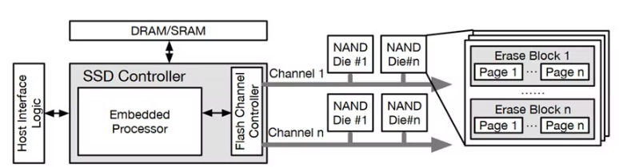

## 什么是SSD
固态硬盘（Solid State Drive, SSD）是一种基于闪存芯片的存储设备。为了增加IO并发性、提高带宽，每个通道（Channel）连接了多个闪存芯片（Die）。每个die包含了多个擦除块（Erase Block），每个block上包含了多个页（Page）。每个page上包含两个区域：（1）数据区域，用于存储用户数据；（2）元数据区域，用于存储纠错码（Error-Correcting Code, ECC）等其它信息。

SSD的性能更优、功耗更低，因此已被广泛整合应用于个人计算机、移动终端设备、数据中心以及云存储之中，逐渐取代传统的HDD设备。与传统的机械硬盘（Hard Disk Drive, HDD）相比较，SSD延迟更低、带宽更高。SSD没有机械运动部件，使其抗震动性能优越、能源消耗更低且没有运行噪声，并显著减少了体积和重量。

## 什么是全闪存储
全闪存储是指存储阵列全部由固态存储介质构成，行业普遍认为全闪存储是存储行业的发展趋势。华为的全闪存储产品OceanStor Dorado相较于传统机械存储，在SPC-1基准测试下业务性能提升了5倍、在数据库场景下业务性能提升了10倍、在虚拟桌面场景下应用启动相应时间缩短了80%。充分体现了全闪存储产品优异的性能。

然而，目前全闪存储还未成为存储领域应用主流，SSD还未完全取代HDD。其中两个重要原因在于（1）SSD与HDD相比，成本较高、容量较小；（2）块接口不适合闪存的特性。

（1）SSD比HDD的容量更小、成本更高

SSD系列产品容量普遍小于HDD系列产品，而SSD的平均每GB单价是HDD的11倍。成本和容量问题是制约SSD取代HDD的一个重要因素。

||容量|整盘价格（美元）|每GB单价（美元）|平均每GB单价（美元）|
|---|---|---|---|---|
|西部数据|||||
|Gold系列HDD|1TB|84.36|0.082|0.032|
||4TB|159.99|0.039||
||6TB|194.99|0.032||
||8TB|229.99|0.028||
||10TB|269.99|0.026||
||12TB|314.99|0.026||
||14TB|355.8|0.025||
||16TB|349.99|0.021||
||18TB|379.99|0.021||
||22TB|459.99|0.020||
|西部数据|||||
|Gold系列SSD|960GB|499.99|0.521|0.356|
||1.92TB|699.99|0.356||
||3.84TB|899.99|0.229||
||7.68TB|2499|0.318||

（2）块接口不适合闪存特性

SSD的闪存芯片支持读取、写入和擦除3种操作。读写操作的粒度是页，而擦除操作的粒度是块。闪存具有不允许就地更新和芯片寿命有限的特性，即每个块在更新其中页时必须先全部擦除、每个闪存单元具有有限的读写循环（Program/Erase, P/E）次数。

SSD为了兼容HDD时代的各种硬件，采用传统的块接口（Block Interface）抽象下层物理设备。块接口要求SSD提供一段连续的逻辑空间，并允许按照任意顺序读取、写入和就地更新数据。而一个擦除块内各个页面的生命周期不同，页会先后失效。为了重新利用擦除块内失效页的空间，SSD需要实现垃圾回收（Garbage Collection, GC）将块内有效数据迁移出去。从而需要在盘内预留过度配置（Over Privisioning, OP）空间以承接有效数据、降低垃圾回收操作带来的性能影响。垃圾回收操作还会导致吞吐量下降、写放大、尾延迟高、闪存寿命下降等一系列问题。

SSD由于先擦后写、擦写粒度不一致的特性存在垃圾回收等数据迁移开销，造成了写放大和空间浪费，写放大还会损耗SSD的寿命。而HDD可以在盘内任意位置擦写，不存在垃圾回收和有效数据迁移。因此，解决块接口和闪存特性不匹配是SSD取代HDD过程中的一个重要问题。