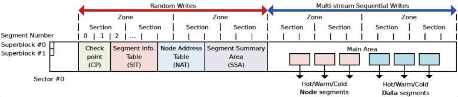
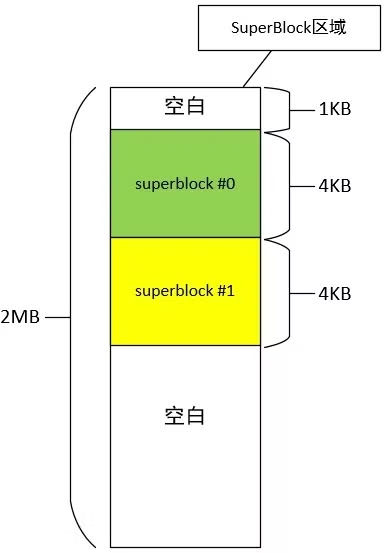

> 可参看https://github.com/RiweiPan/F2FS-NOTES/

## 什么是F2FS

F2FS, Flash Friendly File System，是一种采用日志结构，适合闪存特性的文件系统。

F2FS是从原始LFS的基础上发展来的。详见：[[原始LFS设计]]

F2FS 的设计主要解决了原始 LFS 中的滚雪球式更新元数据（wandering tree）问题。

## F2FS的优点

详见：（本站）F2FS的优点以及与LFS的区别

## F2FS文件系统设计

F2FS在盘上组织为两个区域：随机写区域和顺序写区域。

因此在ZNS SSD上使用F2FS时，还需挂载另一块用于存放元数据的可随机写的盘。



随机写区域存放的是文件系统的元数据，包括超级块、CP、SIT、NAT和SSA。

顺序写区域，也叫Main Area。存放的是Data Page和Node Page。顺序写区域还分为冷热分离的6个log。
## F2FS文件系统的元数据
F2FS中的元数据有超级块、CP、SIT、NAT、SSA。这些元数据放在随机写区域。

这里说的元数据是整个F2FS文件系统的元数据，而不是data的元数据（各种node）。

### 超级块

每个文件系统都有自己的超级块，超级块中存放文件系统整体的关键元数据。超级块（Superblock）存放在F2FS文件系统的起始位置，这样挂载后不用寻址就能直接读到超级块。

超级块区域包含两个struct f2fs_super_block，互为备份。超级块区域的大小为2M，其中前1K留空，每个超级块占4K，后面留空。



文件系统相关的数据结构通常都有三个：盘上的、内存中文件系统专属的和内存中vfs使用的。

#### 盘上数据结构struct f2fs_super_block

f2fs_super_block中的主要内容有：

- zone、section和segment的数量对应关系
- section、segment、block数量
- 元数据区各个部分、主区域segment数量
- 元数据区各个部分、主区域起始地址
- 特殊文件的inode（见下文）
- 用于辨识冷数据的后缀表

详见：[https://mp.weixin.qq.com/s/FbGyxclb1Gesk8_apEexPQ](https://mp.weixin.qq.com/s/FbGyxclb1Gesk8_apEexPQ)

#### 内存管理结构f2fs_sb_info

f2fs_sb_info是内存中用于管理超级块的结构。

在挂载文件系统时，通过init_sb_info将f2fs_super_block中的数据填入f2fs_sb_info中。

包含vfs superblock指针、f2fs_super_block指针以及锁、SIT、NAT对应的内存管理结构等。

#### vfs superblock结构

略
### CP

Checkpoint维护了f2fs的数据一致性，例如segment、node、active segment的状态等。

F2FS在满足一定的条件的情况下，会将当前系统的分配状态写入到Checkpoint中，万一系统出现突然宕机，可以从Checkpoint中恢复到上次回写时的状态。

F2FS维护了两个Checkpoint结构，其中一个是当前正在使用的Checkpoint。另外一个上次回写的稳定的cp。

如果系统出现了宕机，就恢复到上次的稳定cp中。

#### CP的盘上结构

CP占用2个segment大小（4M）。

有资料说CP区域就是两个struct f2fs_checkpoint。但是还有资料说还包含orphan node和active segments。

暂且认为盘上的cp区域由两套f2fs_checkpoint+orphan node+active segment组成。

F2FS使用数据结构`f2fs_checkpoint`表示Checkpoint结构，它保存在磁盘中`f2fs_super_block`之后区域中。

详见 [https://github.com/RiweiPan/F2FS-NOTES/blob/master/F2FS-Layout/Checkpoint%E7%BB%93%E6%9E%84.md](https://github.com/RiweiPan/F2FS-NOTES/blob/master/F2FS-Layout/Checkpoint%E7%BB%93%E6%9E%84.md)

CP中存的是做CP时候的segment journal等，在恢复的时候会恢复到CP时的curseg状态。为了减少写盘次数，f2fs不会每次分配seg、node的时候就去写NAT、SSA等区域，而是放在journal保存在CP结构中。只有这个seg写完的时候才去更新一下。

### SIT

Segment Info Table 占据大小由Main Area中Segment数量决定。主要用于记录Main Area中Segment的分配信息，例如哪些Segment可用，Segment最后修改时间等信息。

SIT的作用是维护每一个segment的block的使用状态以及有效无效状态，目的是便于分配block以及垃圾回收。

详见：[https://github.com/RiweiPan/F2FS-NOTES/blob/master/F2FS-Layout/Segment%20Infomation%20Table%E7%BB%93%E6%9E%84.md](https://github.com/RiweiPan/F2FS-NOTES/blob/master/F2FS-Layout/Segment%20Infomation%20Table%E7%BB%93%E6%9E%84.md)

### NAT

用于记录Node的地址，这是解决wandering tree的关键设计。

详见：[https://github.com/RiweiPan/F2FS-NOTES/blob/master/F2FS-Layout/Node%20Address%20Table%E7%BB%93%E6%9E%84.md](https://github.com/RiweiPan/F2FS-NOTES/blob/master/F2FS-Layout/Node%20Address%20Table%E7%BB%93%E6%9E%84.md)

### SSA

用于反向索引。通过SIT和NAT可以正向索引到主区域中的block。在这里可以通过block找到所属的node。也就是可以实现通过物理地址找到逻辑地址。GC的时候很有用。

同时它也具有通过journal缓存sit或者nat的操作用于数据恢复的作用。

详见：[https://github.com/RiweiPan/F2FS-NOTES/blob/master/F2FS-Layout/Segment%20Summary%20Area%E7%BB%93%E6%9E%84.md](https://github.com/RiweiPan/F2FS-NOTES/blob/master/F2FS-Layout/Segment%20Summary%20Area%E7%BB%93%E6%9E%84.md)

## F2FS中的journal
在f2fs读写文件的时候，每修改一个块，都会改动f2fs_node的地址映射和NAT、SIT信息。为了避免频繁刷盘，f2fs将这种小变化写到journal里，在CP的时候再写入磁盘。

journal相关的数据结构有

```c
struct f2fs_journal {
	union {
		__le16 n_nats; /* 这个journal里面包含多少个nat_journal对象 */
		__le16 n_sits; /* 这个journal里面包含多少个sit_journal对象 */
	};
	/* spare area is used by NAT or SIT journals or extra info */
	union {
		struct nat_journal nat_j;
		struct sit_journal sit_j;
		struct f2fs_extra_info info;
	};
} __packed;
```

这表示一个f2fs_journal要么保存nat，要么保存sit。

nat journal:

```c
struct nat_journal {
	struct nat_journal_entry entries[NAT_JOURNAL_ENTRIES];
	__u8 reserved[NAT_JOURNAL_RESERVED];
} __packed;

struct nat_journal_entry {
	__le32 nid;
	struct f2fs_nat_entry ne;
} __packed;

struct f2fs_nat_entry {
	__u8 version;		/* latest version of cached nat entry */
	__le32 ino;		/* inode number */
	__le32 block_addr;	/* block address */
} __packed;
```

sit journal

```c
struct sit_journal {
	struct sit_journal_entry entries[SIT_JOURNAL_ENTRIES];
	__u8 reserved[SIT_JOURNAL_RESERVED];
} __packed;

struct sit_journal_entry {
	__le32 segno;
	struct f2fs_sit_entry se;
} __packed;

struct f2fs_sit_entry {
	__le16 vblocks;				/* reference above */
	__u8 valid_map[SIT_VBLOCK_MAP_SIZE];	/* SIT_VBLOCK_MAP_SIZE = 64，64 * 8 = 512 可以表示每一个块的valid状态 */
	__le64 mtime;				/* segment age for cleaning */
} __packed;
```

在f2fs_get_node_info中，首先在journal中找到地址。如果没找到，再去读盘上的f2fs_nat_block。

在cp的时候，将journal的信息写盘。

1. `f2fs_flush_nat_entries` 和 `f2fs_flush_sit_entries` 函数将entry都写入到 `curseg_info->f2fs_summary->journal` 的变量中。
2. `do_checkpoint函数` 读取 `curseg_info->f2fs_summary`，然后通过函数`f2fs_write_node_summaries`或`f2fs_write_data_summaries` 刷写到磁盘中。

## F2FS中文件的组织
文件分为数据和元数据两部分：数据是指文件保存的内容，元数据是指为了管理和组织数据而附加的结构。

一般文件采用inode-data模式，即一个inode代表管理一个文件的抓手，通过inode的操作可以访问文件数据。

F2FS中的inode包括Metadata部分和数据块寻址部分。Metadata部分是用于描述文件的元数据，数据块寻址部分是用来找到文件中给定index的块。
### 文件寻址
直接记录数据块地址的元数据称为dnode。一个dnode中包含许多index->数据地址的映射条目。

dnode数量太多，无法全部放入inode中，因此存在indnode，用来存放index->dnode的映射条目。

由于inode自己保存了923个数据块地址，所以inode也可以算作dnode。

每个node page的大小都是4K。

1. inode本身保存了923个数据块的地址，称为direct pointer
2. `f2fs_inode->i_nid[0~1]` 保存了两个 `direct_node` 的地址，这里可以保存 2 x 1018个block的数据
3. `f2fs_inode->i_nid[2~3]` 保存了两个`indirect_node` 的地址，这两个其中2个`indirect_node`保存的是 `direct_node` 的nid，因此可以保存 2 x 1018 x 1018个block的数据;
4. `f2fs_inode->i_nid[4]` 保存了一个`indirect_node` 的地址，这个`indirect_node`保存的是 `indirect_node` 的nid，因此可以保存 1018 x 1018 x 1018个页的数据

可以得到如下计算公式: **4KB x (923 + 2 x 1018 + 2 x 1018 x 1018 + 1 x 1018 x 1018 x 1018) = 3.93TB** 因此F2FS单个文件最多了保存3.93TB数据。
### node 结构
这里说的是盘上结构。为了方便管理，inode、dnode和indnode都用f2fs_node描述。用footer区分，nid == ino则是inode。
```c
struct f2fs_node {
	union {
		struct f2fs_inode i;
		struct direct_node dn;
		struct indirect_node in;
	};
	struct node_footer footer; // footer用于记录node的类型
} __packed;

struct node_footer {
	__le32 nid;		/* node id */
	__le32 ino;		/* inode nunmber */
	__le32 flag;		/* include cold/fsync/dentry marks and offset */
	__le64 cp_ver;		/* checkpoint version */
	__le32 next_blkaddr;	/* next node page block address */
} __packed;
```

其中，inode的结构为
```c
struct f2fs_inode {
	...
	__le32 i_addr[DEF_ADDRS_PER_INODE]; // DEF_ADDRS_PER_INODE=923
	__le32 i_nid[DEF_NIDS_PER_INODE];	// DEF_NIDS_PER_INODE=5
	...
} __packed;
```
数组i_addr保存了直接指向的923个地址，下标是数据块的index。

数组i_nid保存了指向的dnode和indnode。下标已经解释过。

dnode的结构为
```c
struct direct_node {
	__le32 addr[ADDRS_PER_BLOCK]; // ADDRS_PER_BLOCK=1018
} __packed;
```
数组addr保存了直接指向的1018个地址，下标是处理后的index。

indnode的结构为
```c
struct indirect_node {
	__le32 nid[NIDS_PER_BLOCK]; // NIDS_PER_BLOCK=1018
} __packed;
```
数组nid保存了指向的dnode的nid，下标是处理后的index。

注意：指向node的都是nid而不是node的地址，因为node的地址在NAT中。

假设一个文件的数据块发生修改，只需要将数据块异地更新后的新地址填入dnode中（这也是异地更新），再在NAT中更新dnode的地址（就地更新）。这样就解决了wandering tree问题。
### 内联数据
小于922 * 4=3688B的文件，数据可以直接放在inode中。

详见：[https://github.com/RiweiPan/F2FS-NOTES/blob/master/Reading-and-Writing/file_data_structure.md](https://github.com/RiweiPan/F2FS-NOTES/blob/master/Reading-and-Writing/file_data_structure.md)
## F2FS中的特殊文件

f2fs中有3个特殊的文件，其inode号分别为1、2、3。

```c
set_sb(node_ino, 1);
set_sb(meta_ino, 2);
set_sb(root_ino, 3);
```

### node_inode

盘上除了数据外，还有node。文件系统将node读入内存后，放在node_inode对应的文件中便于管理和访问。

node_inode文件的data page 里保存了文件系统中读入内存的 node 的数据，顺序更新。根据 nid 可以从 node inode 的 mapping 里获取对应的 page，之后通过 f2fs_get_node_info 从 NAT 获取 nid 对应的 blkaddr，最后提交 io 获取 page。接口为 f2fs_get_node_page。

在 inode 创建时，通过 f2fs_new_inode_page 创建 node page。另外在保留 data block 时，如果现有 node 空间不足以存放 data block addr，则需要通过 ALLOC_NODE 模式调用 f2fs_get_dnode_of_data，在内部创建 node page。

### meta_inode

盘上还有元数据区域，如SSA、NAT等。这些数据在读入内存后，放在meta_inode文件中管理。

### root_inode

文件系统在挂载之后有一个根目录。root_inode对应的就是根目录的目录文件。

### compress_inode

如果开启了压缩功能，还有一个compress_inode，这里略过。

特殊文件的ino号是从1开始的，因为 nid = 0 被视作未分配，或者无效。参考 __get_node_page。另外在 truncate_dnode 里，nid == 0 即视作已经 truncate。

## IPU 和 OPU

ipu，in-place-update 就地更新：在原地更新数据。传统文件系统如 ext4 都采用。

opu，out-of-place-update 异地更新：将更新后的数据写在新的地址，修改映射到新地址。

1. 分配一个新的物理地址
2. 将数据写入新的物理地址
3. 将旧的物理地址无效掉，然后等GC回收
4. 更新逻辑地址和物理地址的映射关系

异地更新更适合闪存特性。 OPU 的缺点在于（1）产生无效块，造成 GC 开销；（2）更新元数据的开销；（3）数据碎片化

## 参考资料
[https://github.com/RiweiPan/F2FS-NOTES/blob/master/F2FS-Layout/Superblock结构.md](https://github.com/RiweiPan/F2FS-NOTES/blob/master/F2FS-Layout/Superblock%E7%BB%93%E6%9E%84.md)

[https://mp.weixin.qq.com/s/9bQSO1rAZIAv9-VMXOfaCA](https://mp.weixin.qq.com/s/9bQSO1rAZIAv9-VMXOfaCA)

[https://mp.weixin.qq.com/s/FbGyxclb1Gesk8_apEexPQ](https://mp.weixin.qq.com/s/FbGyxclb1Gesk8_apEexPQ)

[https://www.cnblogs.com/liuchao719/p/some_special_node_id_in_F2FS.html](https://www.cnblogs.com/liuchao719/p/some_special_node_id_in_F2FS.html%EF%BC%89)

[https://www.cnblogs.com/liuchao719/p/some_special_node_id_in_F2FS.html](https://www.cnblogs.com/liuchao719/p/some_special_node_id_in_F2FS.html%EF%BC%89)