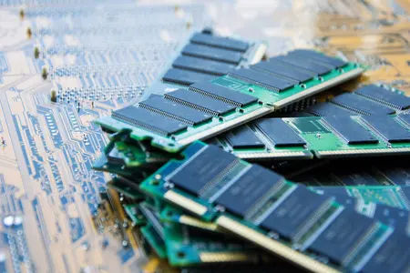
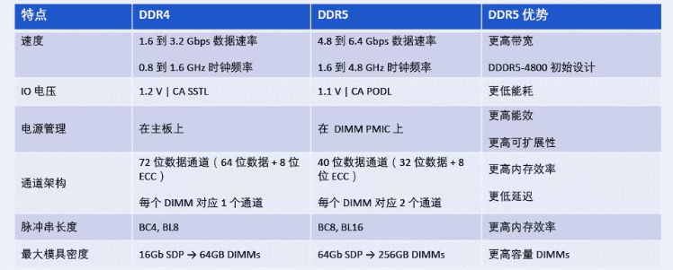
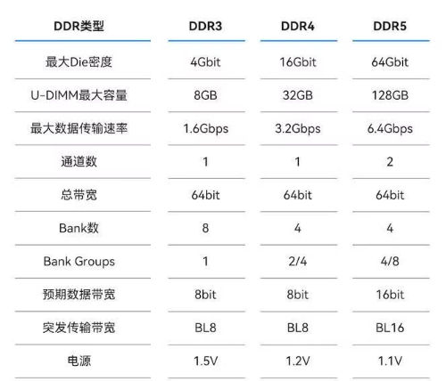

## 什么是内存

内存是与CPU直接交换数据的内部存储器。内存中存放的是计算机运行时必须的数据，包括操作系统、进程等。任何数据在被CPU操作之前，必须先读入内存。

内存属于计算机系统内部，而外存属于计算机系统的外设。内存可以看作是外存的cache。

- 一种比喻是：如果您有一张书桌和一个文件柜，书桌代表电脑的内存。您需要马上使用的材料留在书桌上，以便轻松找到。当您离开办公室时，留在桌上的任何文件都会被扔掉。文件柜中的任何东西都会保留下来。

内存通常由随机访问存储器（Random Access Memory, RAM）构成。因此内存和RAM有时是混用的。

- RAM分为动态RAM（DRAM）和静态RAM（SRAM），内存由DRAM构成。
    - SRAM比DRAM更快、功耗更低。但是容量更小、价格更高、设计更复杂，通常用于CPU内部的高速缓存。详见：（本站）存储的层次结构（Memory Hierarchy） 、[https://www.amazonaws.cn/knowledge/what-is-memory/](https://www.amazonaws.cn/knowledge/what-is-memory/)

下图的黑色部分是存储器模块，通过存储控制器管理。存储器模块中有 DRAM 芯片。

## 内存的作用

内存的数据是临时的、易失的，而外存的数据是持久存储的。电脑关机时，内存是空的，所有的数据都保存在外存上。

电脑启动时，BIOS先自检，然后通过引导加载程序将操作系统加载进内存，这样才能通过操作系统使用计算机。

操作系统想要执行程序，必须将程序的代码读入内存，并在内存上分配程序必须的地址空间。此外，进程想要使用任何文件，都必须先将其内容读入内存。

CPU只能通过内存访问数据，因此内存容量与程序运行速度、并发处理任务的效率很有关系。

## 什么是DDR、LPDDR？

经常看到DDR4、DDR5等表述，这些表述是什么意思？

### DDR

双倍数据率同步动态随机存储器（Double Data Rate Synchronous Dynamic Random Access Memory, DDR SDRAM）。DDR是DDR SDRAM的简称。

其中

- SDRAM代表同步动态随机存取存储器，SDRAM是在DRAM的基础上增加同步和双区域的功能，使得CPU能与SDRAM的时钟同步，因此SDRAM比DRAM访问更快。
- DDR代表双倍数据传输率。一个时钟周期内，SDRAM只在上升沿传输一次数据，而DDR则在上升沿和下降沿各传输一次数据。所以数据传输速度是CPU主频的两倍。因此DDR SDRAM比SDRAM更快。

参考：[https://zh.wikipedia.org/wiki/DDR_SDRAM](https://zh.wikipedia.org/wiki/DDR_SDRAM)、[https://zh.wikipedia.org/wiki/SDRAM](https://zh.wikipedia.org/wiki/SDRAM)

DDR5是最新的第5代DDR，在2021年推出。与DDR4相比，DDR5具有以下优势。

参考：[https://www.rambus.com/blogs/ddr5-%E4%B8%8E-ddr4-%E6%89%80%E6%9C%89%E8%AE%BE%E8%AE%A1%E6%8C%91%E6%88%98%E4%B8%8E%E4%BC%98%E5%8A%BF/?lang=zh-hans](https://www.rambus.com/blogs/ddr5-%E4%B8%8E-ddr4-%E6%89%80%E6%9C%89%E8%AE%BE%E8%AE%A1%E6%8C%91%E6%88%98%E4%B8%8E%E4%BC%98%E5%8A%BF/?lang=zh-hans)

此外，DRAM和各代DDR SDRAM的数据如下。

||DRAM|DDR|DDR2|DDR3|DDR4|DDR5|
|---|---|---|---|---|---|---|
|預取|1 - 位元|2 - 位元|4 - 位元|8 - 位元|每記憶庫位元|16 - 位元|
|資料速率 (MT/s)|100 - 166|266 - 400|533 - 800|1066 - 1600|2133 - 5100|3200 - 6400|
|傳輸速率 (GB/s)|0.8 - 1.3|2.1 - 3.2|4.2 - 6.4|8.5 - 14.9|17 - 25.6|38.4 - 51.2|
|電壓 (V)|3.3|2.5 - 2.6|1.8|1.35 - 1.5|1.2|1.1|

[https://www.crucial.tw/articles/about-memory/difference-among-ddr2-ddr3-ddr4-and-ddr5-memory](https://www.crucial.tw/articles/about-memory/difference-among-ddr2-ddr3-ddr4-and-ddr5-memory)

注意：一般一种主板只支持一种类型的内存。因为各代DDR之间的物理结构（插槽不一样）、电气规范、工作电压、时钟速度和通信协议上都有差异。不同代内存不能混用。

### LPDDR

LPDDR的全称是Low Power Double Data Rate SDRAM，也即移动DDR（Mobile DDR, MDDR或Low Power DDR, LPDDR）。

MDDR的运行电压（工作电压）低于DDR的标准电压，因此MDDR具有低功耗、高可靠性的特点。适合移动设备使用。

LPDDR5是2019年推出的，最新规范为LPDDR5X（2021）。

参考：[https://zh.wikipedia.org/wiki/移动DDR#LPDDR5](https://zh.wikipedia.org/wiki/%E7%A7%BB%E5%8A%A8DDR#LPDDR5)

## 未列出的参考资料

[https://www.crucial.cn/articles/about-memory/what-does-ram-stand-for](https://www.crucial.cn/articles/about-memory/what-does-ram-stand-for)

[https://www.kingston.com/cn/blog/pc-performance/difference-between-memory-storage](https://www.kingston.com/cn/blog/pc-performance/difference-between-memory-storage)