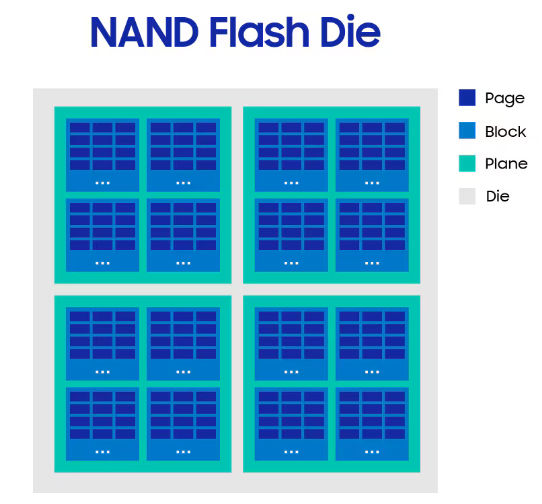
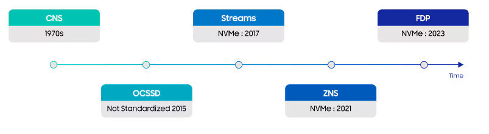
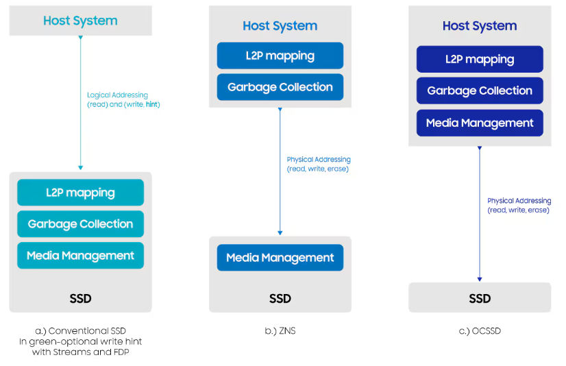
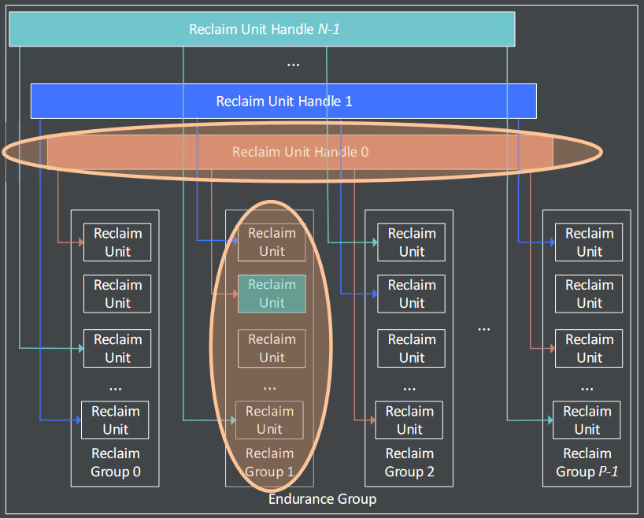
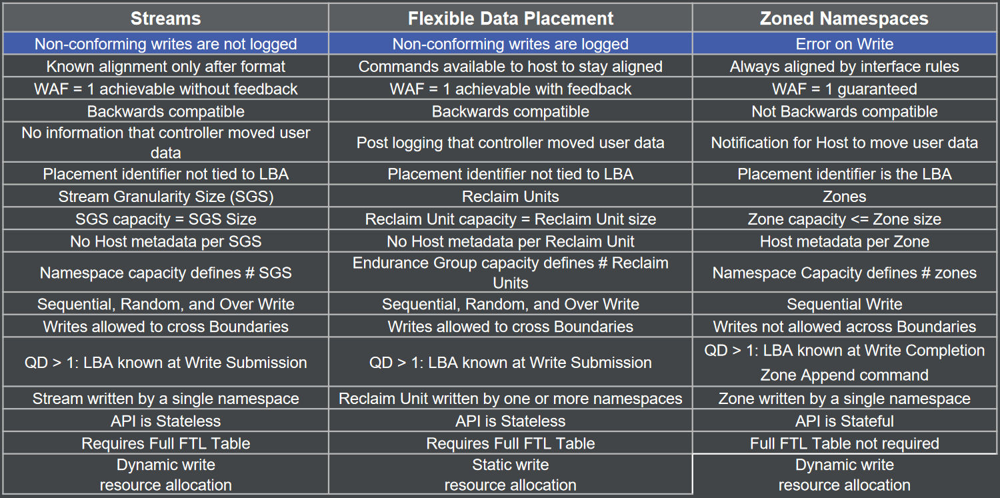

# 数据放置技术简介
在固态硬盘（SSD）领域，数据放置技术是用来使主机能够控制数据在 SSD 内部如何放置的技术。这是因为传统上主机只能控制数据在逻辑上的地址，而不能真正控制其在物理上如何放置。

数据放置技术的作用有：1. 减少 SSD 的写放大；2. 提高 SSD 的服务质量（QoS）；3. 减少过度配置（OP）；4. 优化 SSD 的总体拥有成本（TCO）。
## 为什么需要数据放置技术
下图是 SSD 内部结构示意。SSD 用 NAND 闪存颗粒存储数据，SSD 内部的 NAND 颗粒通过 die、plane、block 和 page 组织。

传统的 SSD 中，主机通过逻辑地址 LBA 读写 SSD 的数据。NAND SSD 是不能覆盖写的，必须要写前擦除。擦除是以闪存块为单位的，一般是 MB 级别；写操作以闪存页为单位，一般是 KB 级别。因此 SSD 实际上是不能就地更新的，必须将待写的页写入一个新的块，再通过 FTL 将 LBA 映射到这个新的块。

这导致了垃圾回收和写放大。垃圾回收和写放大是指 FTL 将 LBA 映射到新的物理地址后，原来物理地址中的数据就失效了。当一个闪存块中失效页的数量达到一定程度时，为了释放失效页的空间，需要将有效数据迁移到别的闪存块，再擦除该块，这叫做垃圾回收。由于垃圾回收而引起的有效数据迁移叫做写放大。写放大不仅加速了 SSD 的磨损老化，降低了 SSD 的寿命；还增加了读写延迟，降低了 SSD 的性能和 QoS。

为了减少写放大，主机可以利用数据放置技术将生命周期相近的数据块放置在相近的位置，以便使他们同时失效，从而减少垃圾回收的开销。但是由于 FTL 决定了数据的放置，传统 SSD是不能做到这一点的。
## 有哪些数据放置技术

（CNS 是指传统 SSD）
### Open Channel SSD（OCSSD）
Open Channel SSD (OCSSD) 是最早的数据放置技术。Open Channel 将盘内布局完全暴露给主机，也即主机需要完成 FTL 的所有工作，包括映射、垃圾回收和磨损均衡等。

但是由于各个厂商生产的 SSD 各不相同，且 SSD 的管理变得越来越复杂，主机无法适配每一种 SSD。因此 OCSSD 技术从未标准化并且最终退出市场。
### Multi-Stream
多流（Multi-Stream）是随后出现的数据放置技术。原理是主机根据数据类型的不同，如温度，给写命令附上一个 hint。SSD 通过 hint 将数据放置到不同区域。

多流的实现很简单，并且兼容性好。如果主机不给 hint，就和传统盘完全一样。

多流曾经标准化过，并且也进入过 Linux 主线。但是多流太简单，效果也不好。最终缺乏市场吸引力，Linux 也移除了支持。
### Zoned Namespace SSD (ZNS SSD)
ZNS SSD 根据 LBA 将 SSD 空间顺序地划分为若干 zone，并以 zone 为读写的基本单位。在 zone 内只允许主机顺序写。主机需要顺序发送写请求，并且完成 zone 的管理和垃圾回收。

ZNS 利用已经存在的 ZAC/ZBC 标准，并且将物理介质的管理留给设备的 FTL。因此较为容易标准化。但是顺序写入的限制使得主机兼容难度较大。因此 ZNS 只适合特定的应用场景，例如日志结构的文件系统。

|        | OCSSD        | Multi-Stream | ZNS SSD         |
| ------ | ------------ | ------------ | --------------- |
| 主机干预程度 | 主机完全控制       | 主机轻量级控制      | 主机控制数据放置，但不管理介质 |
| 采用难度   | 需要大幅修改主机存储栈  | 简单修改主机存储栈    | 需要大幅修改主机存储栈     |
| 兼容性    | 不兼容          | 兼容           | 不兼容             |
| 写放大    | 可以到 1        | 不能保证         | 可以到 1           |
| 现状     | 从未标准化，已经退出市场 | 标准化，但退出市场    | 标准化，但对市场吸引力低    |

### Flexible Data Placement (FDP)
从上面数据放置技术的失败可以看出，好的数据放置技术必须要

1. 将介质管理的工作留给 SSD，这是因为在主机管理 SSD 介质是非常复杂的，考虑到 SSD 厂商和种类的不同，主机几乎不可能兼容所有的 SSD。
2. 不要对主机软件栈做过多的修改，这是因为主机的应用软件已经非常稳定，而数据放置技术却在频繁更新发展。软件不可能为了兼容一种新的存储协议，如 ZNS，做全面的修改。
3. 产业支持和切实的应用场景非常重要。对于多流来说，虽然使用简单，但是没有应用场景，所以市场也不会买账。

FDP 技术将 SSD 划分为  Reclaim Group，一个 Reclaim Group 上有若干 Reclaim Unit。主机通过指定 Reclaim Group 和 Reclaim Unit Handle 确定要将数据放置在哪个 Reclaim Unit 中。

FDP 可以兼容传统软件栈，如果不指定 Reclaim Group 和 Reclaim Unit Handle ，就按照传统 SSD 的方式写入。

FDP 还可以将盘内信息反馈给主机，下面是多流、ZNS 和 FDP 的对比。

## 总结
数据放置技术的历史并不长，第一个数据放置技术 OCSSD 的产生距今还不到 10 年。目前数据放置领域最重要的两个技术是 ZNS 和 FDP，两者各有优劣。

- ZNS 
	- 优势：没有 OP 和盘内 GC、消除映射表
	- 劣势：顺序写限制、只能在单一命名空间内写入
- FDP
	- 优势：支持随机写、兼容性好、可以写入多个命名空间
	- 劣势：需要完整映射表、OP 和盘内 GC

由于 FDP 的兼容性好，没有顺序写入的限制，预计 FDP 将会成为新一代主流数据放置技术，极大改变 SSD 的生态。而 ZNS 技术将仅限于适合顺序写入的场景，例如日志结构文件系统 F2FS 等。
## 参考资料
https://semiconductor.samsung.com/news-events/tech-blog/a-brief-history-of-data-placement-technologies/

https://download.semiconductor.samsung.com/resources/white-paper/getting-started-with-fdp-v4.pdf