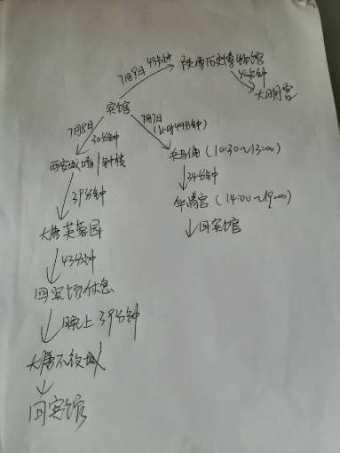
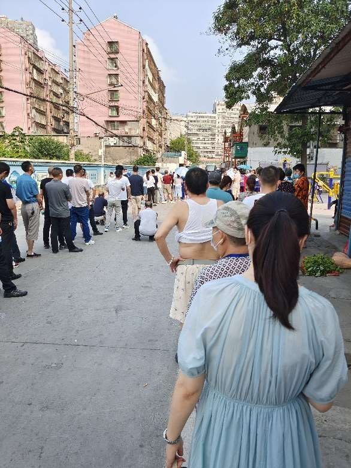

## 2021.7.6

7 月 6 日黄和同学从武汉来游。他早在 6 月中旬左右和我说过，而这一日终于来了。这是他之前和我说过的旅游计划。

按理说我应该亲赴西安北站相迎，以尽地主之谊。不过这一时期我白天需测控实习，无暇接站，只好请他们吃饭。下课后我联系他们，约在西门见面。他们刚收拾完房间，便前来学校。他的同学也是湖北人，口音于我不算陌生。见面寒暄后，我带他们在校内参观。他们对学校的设施之齐全、建筑之气派连声赞叹，但对于去过几次创新港的我来说，兴庆校区的楼看起来比较破旧。 

从东南门出校门后，我们在四川菜馆吃饭。饭后我带他们原路返回，这时已有大风吹过，天气预报说即将下暴雨。而他们难以置信，毕竟白天阳光明媚，完全没有要下雨的迹象。在我们前往最佳打卡地之一的北门拍照的路上，风越来越大，零星雨点已开始下落。匆匆照过相后我送他们去路口，就各自快步返回了。回宿舍时已经开始下大雨，他们只是最后在楼下淋了一点雨。

后来的某一天，他说他的同学对西安交大还是念念不忘。我如鲠在喉，不知如何作答。

## 2021.7.16 

2020 级学生这天公布选专业结果，这一届的计算机专业分数最高，打破了西安交大电类长期以来自动化最卷的情况。这也导致我不想跨选到下一届的课程中去。

## 2021.7.20

由于成日囿于寝室倍感无聊，这天我随李泓宁去创新港，打算换一个地方自习。但创新港只是实验室、办公室、研讨室多，假期公开可使用的教室很少，而且蚊子很多。这里⾷堂比较实惠，然而兴庆是永不可能有这般条件了。 

## 2021.8.1

回家的前一天晚上看奥运会，陈雨菲对战中国台北运动员戴资颖，以陈雨菲获胜告终。这也是我第一次主动收看体育赛事直播。

## 2021.8.2

回家当天家里就成了疫情城市，不过我并不在中风险区范围内。到最后也只有一开始的两例，这天封住后再也没有新增。社区开展核酸检测，场面十分混乱，不少人没有带口罩，这样的检测不是更容易暴发疫情吗？所幸没有阳性者在场。
