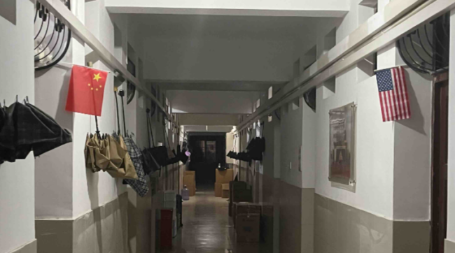

## 6月24日

最后一科的成绩也出了。这样，我本科的所有考试都结束了。而我并没有任何加分，加权成绩89.2269，就是保研的学分成绩。

没想到本科考得最差的一次考试，竟也是最后一门考试：形式语言与编译。当时放飞了自我，面对考试已经忘乎所以了。我把全部的希望放在计算机大群里的一张往年考题的照片上，赌今年的题型一模一样。结果今年试题大改，难度陡然加深。我在考场上头脑一片空白，汗流不止，手不住颤抖。整张试卷翻来翻去没有几道会做的题，想要把试卷写满都做不到。收卷后考场里哀怨不止，考差的不是一个两个，看来大家都被群里的照片给带偏了。

我想，最低也不过七十几分吧。一看傻了眼——差点不及格。高过来问我多少分，我实在是说不出口。他说好些成绩好的都翻车了。

没复习好固然是我的原因，不过任课老师的讲课水平也是公认的烂。讲课拖拖沓沓不着重点也罢了，毕竟大部分的课程都是自学。但是这次卷子是另一个老师出的，他考前看也没看，到了考场上才发现有的内容他没讲过。他在考场上当场解释，这要怎么做得出来？

## 6月30日

连着许多天都在书院当巡逻志愿者，发现有的寝室门口挂的是美国国旗，和左边针锋相对。

7月1日
嵌入式系统老师（李保红）把我们骂得狗血淋头，不过如果这都不知道，要我我也骂。
8月8日
太搞笑了，还是放一下
烟标是世界三大平面收藏品之一，在沙市实中曾风靡一时，而黄飞扬就是这项活动的忠实爱好者。据他的班主任说，“黄飞扬虽然成绩好，但是不摆架子，一下课就和同学们玩烟标”。不过在沙市，好像也只有他们沙棉一带的人那时候玩。他们虽玩烟标，但从不买烟。每次都是在地上看到不要的烟盒子就捡起来叠好。如今他家里还有一大盒烟标，他舍不得扔。

8月15日
骑电动车的时候手机放在裤袋里掉了出来，出于安全没有立刻去捡。我想压过它的应该是一辆自行车，要不然不会只有膜碎了。

8月20日
“8·20会议”
晚上和黄飞扬散步，聊到武汉科技大学强制搬宿舍的事情。我说湘潭大学也在高强制搬宿舍，高中我是组长，其中有一个组员李旭灿在湘潭大学读书。我问他考研能否去湘潭大学，他说那要看有没有全日制的会计学专硕（MPAcc）专业了，因为很多学校不招收全日制的MPAcc。没想到湘潭大学正好有，并且初试分数线非常合适。读四川师范大学怕遇到地震，读华侨大学怕碰上打台湾，湘潭大学比较“安全”，并且学费也合适，地理位置也近。最重要的是名字一听就很“正规”。因为他认为正在就读的武汉纺织大学虽然是一本，但是名字里有“纺织”两个字就很掉价。他家就住在沙棉，周围全是搞纺织的，亲戚也在纺织厂上班，他对纺织实在是厌倦了。

“还有什么名字不行，交通行不行？”

“只要没有纺织或者轻工业就行。”

我又说给武汉纺织大学改个名字怎么样？因为校训是“经天纬地，自强不息”，所以可以改名“经纬大学”。我们还想了很多新校名，如“天地大学”、“江夏大学”、“武汉大学纺织校区”、“武汉大学江夏校区”等。

总之根据“8·20会议”的精神，他认为湘潭大学是不错的选择。马上考研预报名了，他准备去报湘潭大学。不过，湘潭让他联想到了“湘潭铺子”，去湘潭会不会染上嚼槟榔的恶习？