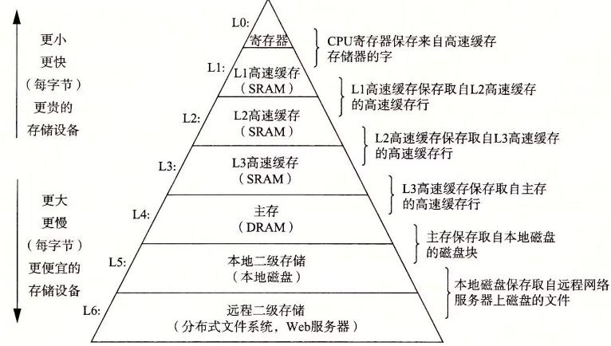
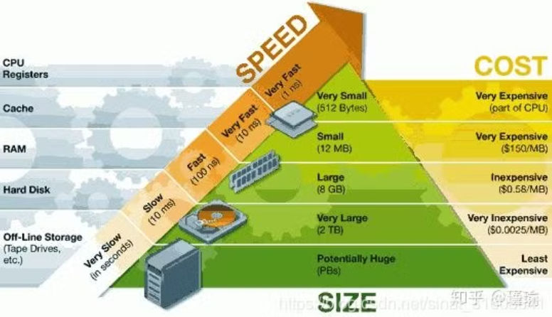
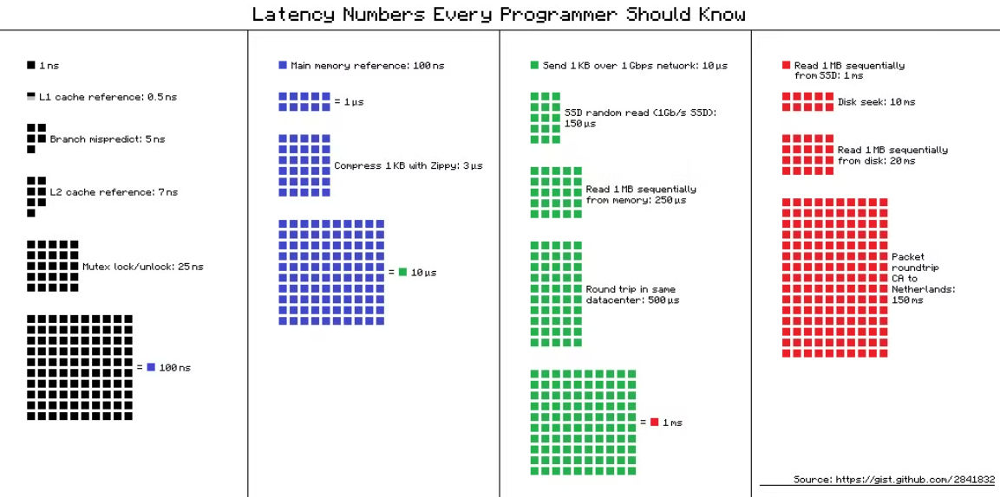
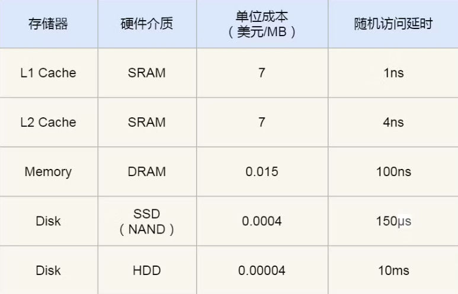

## 什么是存储的层次结构

计算机系统中的各级存储设备具有访问速度从快到慢、存储容量从小到大、存储单价由高到低的金字塔层次结构。

存储的层次结构基于缓存原理。缓存的意思是，一方面某个存储设备中存了大量的数据，而当前需要使用的只是其中的一小部分；另一方面通常访问速度越快的存储设备其容量就越小。因此，可以采用访问速度较快而容量较小的存储设备去存放当前需要使用的一小部分数据，从而加快数据的访问速度。

缓存之所以能够存放当前需要使用的一小部分数据，是因为局部性原理。局部性原理分为时间局部性和空间局部性。时间局部性是指当前访问过的数据，很可能马上又需要访问；空间局部性是指和当前访问数据相邻的数据，很可能马上需要访问。因此缓存中可以存放刚刚访问过的数据以及其邻近的数据。

根据存储的金字塔层级结构，可以认为每一级存储都可以看成是上一级存储的缓存。

在访问数据的时候，总是先查找数据是否存在于缓存中。如果存在则称为缓存命中，否则就从下一级存储中将数据读入缓存。下一级没有则去更下一级找，在本地直到查找到硬盘，如果可以访问远程存储还可以从远程读取数据。


## 存储的金字塔层次结构







### Level 0：寄存器

寄存器（register）有32、64等不同位的。可以存储4B、8B的数据。一个CPU内的寄存器数量和CPU架构有关，少的有几十个，多的有几百个。

寄存器的访问速度是最快的：

- 一方面是因为寄存器在CPU内部，距离CPU更近。但是距离在单机不是一个主要因素。
    
    以3GHz的CPU为例，电流每秒钟可以振荡30亿次，每次耗时大约为0.33纳秒。光在1纳秒的时间内，可以前进30厘米。也就是说，在CPU的一个时钟周期内，光可以前进10厘米。因此，如果内存距离CPU超过5厘米，就不可能在一个时钟周期内完成数据的读取，这还没有考虑硬件的限制和电流实际上达不到光速。相比之下，寄存器在CPU内部，当然读起来会快一点。
    
    距离对于桌面电脑影响很大，对于手机影响就要小得多。手机CPU的时钟频率比较慢（iPhone 5s为1.3GHz），而且手机的内存紧挨着CPU。
    
- 另一方面由于CPU直接存取寄存器，读写速度在一个时钟周期以内。设CPU主频为2GHz，则时钟周期为0.5ns。因此寄存器的访问延迟在1纳秒级。

### Level 1、2、3：高速缓存

CPU内部的高速缓存由SRAM组成，比内存使用的DRAM更快、功耗更低。但是容量更小、价格更高、设计更复杂。因此适合作为缓存。

#### L1 高速缓存

L1 高速缓存的访问速度几乎和寄存器一样快，通常只需要 2~4 个时钟周期，而大小在几十 KB 到几百 KB 不等。

每个 CPU 核心都有一块属于自己的 L1 高速缓存，指令和数据在 L1 是分开存放的，所以 L1 高速缓存通常分成指令缓存和数据缓存。

在 Linux 系统，我们可以通过这条命令，查看 CPU 里的 L1 Cache 「数据」缓存的容量大小：

```
$ cat /sys/devices/system/cpu/cpu0/cache/index0/size
32K
```

而查看 L1 Cache 「指令」缓存的容量大小，则是：

```
$ cat /sys/devices/system/cpu/cpu0/cache/index1/size
32K
```

#### L2 高速缓存

L2 高速缓存同样每个 CPU 核心都有，但是 L2 高速缓存位置比 L1 高速缓存距离 CPU 核心更远，它大小比 L1 高速缓存更大，CPU 型号不同大小也就不同，通常大小在几百 KB 到几 MB 不等，访问速度则更慢，速度在 10~20 个时钟周期。

在 Linux 系统，我们可以通过这条命令，查看 CPU 里的 L2 Cache 的容量大小：

```
$ cat /sys/devices/system/cpu/cpu0/cache/index2/size
256K
```

#### L3 高速缓存

L3 高速缓存通常是多个 CPU 核心共用的，位置比 L2 高速缓存距离 CPU 核心 更远，大小也会更大些，通常大小在几 MB 到几十 MB 不等，具体值根据 CPU 型号而定。访问速度相对也比较慢一些，访问速度在 20~60个时钟周期。

在 Linux 系统，我们可以通过这条命令，查看 CPU 里的 L3 Cache 的容量大小：

```
$ cat /sys/devices/system/cpu/cpu0/cache/index3/size

3072K
```

### Level 4：内存（主存）

内存（memory、primary storage）是计算机运行过程中用到的主要存储空间。内存中存放着操作系统、进程运行所需的数据、代码等内容。

内存由DRAM组成，访问速度比硬盘（HDD、SSD等）要快很多，但是是易失性的，也即断电后数据就没有了。

DRAM 存储一个 bit 数据，只需要一个晶体管和一个电容就能存储，但是因为数据会被存储在电容里，电容会不断漏电，所以需要「定时刷新」电容，才能保证数据不会被丢失，这就是 DRAM 之所以被称为「动态」存储器的原因，只有不断刷新，数据才能被存储起来。

DRAM 的数据访问电路和刷新电路都比 SRAM 更复杂，所以访问的速度会更慢，内存速度大概在 200~300 个 时钟周期之间。属于百纳秒级别（0.1μs）。

CPU L1 Cache 随机访问延时是 1 纳秒，内存则是 100 纳秒，所以 CPU L1 Cache 比内存快 100 倍左右。


详见：（本站）什么是内存

### Level 5 外存（辅存）

外存是用于持久化保存数据的存储设备。外存的容量比内存更大，数据是非易失的。但外存的访问速度更慢。

目前主流的外存有机械硬盘（HDD）、固态硬盘（SSD）。

详见：（本站）SSD简介

SSD 比机械硬盘快 70 倍左右；内存比机械硬盘快 100000 倍左右；CPU L1 Cache 比机械硬盘快 10000000 倍左右。



### Level 6 远程存储

此处略。

# 参考资料

https://hansimov.gitbook.io/csapp/ch01-a-tour-of-computer-systems/1.6

https://blog.csdn.net/sinat_31608641/article/details/110684664

https://blog.csdn.net/qq_37442469/article/details/124180541

https://www.geeksforgeeks.org/difference-between-sram-and-dram/

https://en.wikipedia.org/wiki/Static_random-access_memory

https://en.wikipedia.org/wiki/Cache_(computing)

https://en.wikipedia.org/wiki/Processor_register