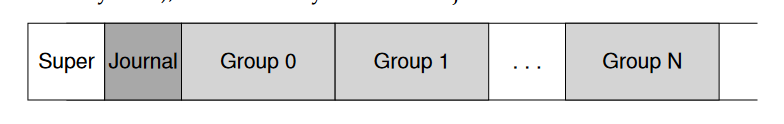
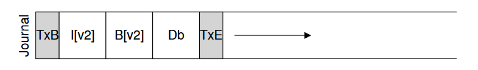

## 事务的原子性和文件系统的崩溃一致性

事务的原子性是指一个事务要么被执行，要么不被执行，不能执行一半。

在文件系统中，由于存在突然掉电的情况，会导致文件系统的不一致。这就是文件系统的崩溃一致性（Crash Consistency）问题。

> 例 1：

一个事务包含多个写 IO，删除文件的步骤有

- 删除该文件的条目；
- 将文件占用的块在 bitmap 中置为 0。
- 如果在 1、2 之间掉电，会导致上电后文件系统不一致。

> 例 2：

一个事务包含一个写 IO，一个写 IO 在从文件系统到硬件设备的每一个环节都很有可能被分解为多个 IO。如 write_data_pages->write_data_page；在 IO 控制器、硬盘上往往会由缓冲 buffer 分割写入。如果一个文件没有完全落盘就突然掉电，则该文件可能修改了一部分，造成不一致。

注意：读 IO 不会影响原子性和一致性。

关于文件系统不一致的例子参看[file-journaling.pdf](https://pages.cs.wisc.edu/~remzi/OSTEP/file-journaling.pdf)，一般会有垃圾数据、空间泄漏和文件系统元数据结构不一致等问题。只有一种情况，即只写了数据却没有更新 inode 和 bitmap 这两个元数据的时候，才没有造成文件系统不一致，只是用户丢失了数据。

## 解决方法

要解决文件系统的崩溃一致性问题，需要保证文件系统从一个稳定的状态原子地转移到另一个稳定的状态。

### lazy approach：fsck （fs check）检查文件系统状态

早期文件系统放任不一致，上电以后再解决这个问题。fsck 是一个在挂载文件系统之前检查并修复文件系统不一致的 Unix 工具。

- 检查超级块，成员数值是否合理。
- 检查 inode、dnode 等和 bitmap 是否一致。不一致则以前者为准。
- 检查 inode 是否完整，如有没有类型等。有问题的 inode 直接清除并更新 bitmap。
- 检查 inode 的实际引用计数和 inode 自己记录的计数是否一致，以前者为准。如果找不到对于某个文件的引用，就放到 lost+found 目录下。
- 检查块的引用。如果有两个 inode 指向同一个块，要么清除一个坏的 inode，要么给他们各自复制一份。
- 检查 inode、dnode 指针合理性，如果指向不存在的地址，就清除。
- 检查目录合理性，如首先要含有.和..，目录包含的 inode 是分配过的，目录要满足树形结构。
- 构建 fsck 需要非常了解该文件系统的只是，并且 fsck 太慢了，不适用于 RAID。

### 日志文件系统

为了避免写 IO 途中断电带来的不一致性，在文件系统层面可以采用日志技术（Journaling 或者 Write-Ahead-Logging）。很多文件系统，如 ext3/4、JFS、XFS 和 NTFS 等都是日志文件系统。
文件系统日志（Journal 或 log）是硬盘中一个单独的文件。向盘中写数据的时候，先不写入真正的位置，而是将这个动作记录在 journal 里。这样，在真正写盘的时候即使掉电，也可以通过 journal 恢复。

#### 写入
以 ext3 （ext 系列文件系统参考[这里](https://junmajinlong.github.io/linux/ext_filesystem/index.html)）为例

如果向某个文件追加一个 Db 块，则在 log 中写入新的 inode、bitmap 和 Db 以及 addr。并标记首尾。接下来将这三个 IO 实际写入盘上。这叫做 checkpoint。

在 journal 的时候断电怎么办？应该先写前 4 个块，成功返回后再写 TxE，保证原子性。写前 4 个块叫做 journal write，写 TxE 叫做 journal commit。 注意 HDD 可以保证 512B 以下写入的原子性。或者，在 ext4 中，首尾标志引入了 checksum，可以通过比较存储的 checksum 和计算出的是否一致判断有没有原子写入 journal。

#### 恢复

在 journal commit 之前断电，我们不恢复。在 checkpoint 途中断电，可以通过 journal 恢复。

- write barrier
为了保证写入的顺序，可以等待上一个写入返回后再下发下一个写入。但是由于数据写到写 buffer 里面就返回了，这样还是没办法保证写入顺序。write barrier 是一个操作系统发送给盘的命令，当这个命令完成时，保证命令之前的写入全部完成，并且命令之后的写入全部没有完成。

- redo logging
扫描所有已经 commit 的 journal，在盘上把 journal 的内容重新执行一遍。存在冗余写但是肯定一致。

- batching log updates
不必每个操作都作为事务。可以积攒一段时间再写入 log。

- circular log
已经 cp 的事务，它的 journal 可以 free 了。循环使用 log 空间。可以在 journal super block 里面标记有用的 journal。

- metadata journaling
不把数据写到 journal 里，只写元数据。这要求先将数据落盘，然后将元数据的更新写到 journal 里，最后对这个元数据的事务做 cp，并释放相关 journal。NTFS 和 XFS 都这样干，Ext3 可以选择要不要这样干。
不过，数据和元数据其实是可以一起写，只要保证数据写下去之后再 commit 就可以了。
崩溃一致性的核心：先写内容（数据），再写指向内容的指针（元数据）。

# 参考资料

https://blog.csdn.net/TV8MbnO2Y2RfU/article/details/78103771

https://pages.cs.wisc.edu/~remzi/OSTEP/file-journaling.pdf